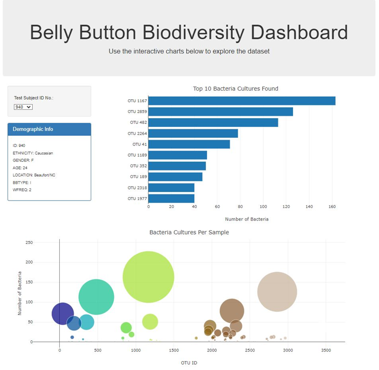

# Belly-Button-Challenge 

# Belly Button Biodiversity Dashboard

## Overview
This project involves building an interactive dashboard to explore the Belly Button Biodiversity dataset. The dataset catalogs the microbes that colonize human navels, revealing that a small handful of microbial species were present in more than 70% of people, while the rest were relatively rare.

## Features
### 1. Horizontal Bar Chart
- Displays the top 10 OTUs found in the selected individual.
- **Values:** `sample_values`
- **Labels:** `otu_ids`
- **Hovertext:** `otu_labels`

### 2. Bubble Chart
- Provides a visual representation of each sample.
- **X Values:** `otu_ids`
- **Y Values:** `sample_values`
- **Marker Size:** `sample_values`
- **Marker Colors:** `otu_ids`
- **Text Values:** `otu_labels`

### 3. Metadata Display
- Shows demographic information of the selected individual.
- Loops through the metadata JSON object and presents key-value pairs in a text string format.

### 4. Interactive Dashboard
- Includes a dropdown menu for selecting samples.
- Updates all plots dynamically when a new sample is selected.

## Tools and Technologies Used
- **D3.js**: For reading and visualizing data from the `samples.json` file.
- **HTML/CSS**: For structuring and styling the dashboard.
- **JavaScript**: For creating interactive components and linking them to the data.

## How to Run Locally
1. Clone the repository:
   ```bash
   git clone https://github.com/geraldine1456/belly-button-challenge.git

2. Open the  `index.html` file in a browser to view the dashboard.





## Resources
- [Belly Button Biodiversity Project](https://robdunnlab.com/projects/belly-button-biodiversity/)
- [Samples.json Dataset](https://static.bc-edx.com/data/dl-1-2/m14/lms/starter/samples.json)

## References

-   [D3js Documentation](https://d3js.org/getting-started)
-   [Plotly Documentation](https://plotly.com/javascript/)
-   [MDN Web Documentation](https://developer.mozilla.org/en-US/docs/Web/JavaScript/Reference/Global_Objects/Array/filter)
-   [W3Schools](https://www.w3schools.com/)
-   [Microsoft Copilot](https://copilot.microsoft.com/)  
